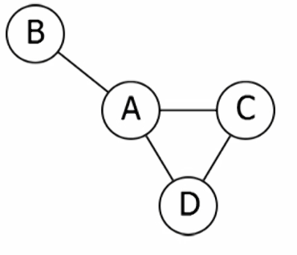
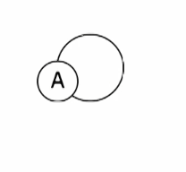
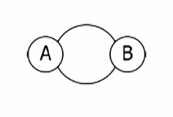
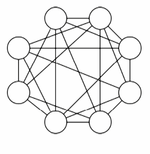
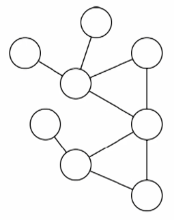
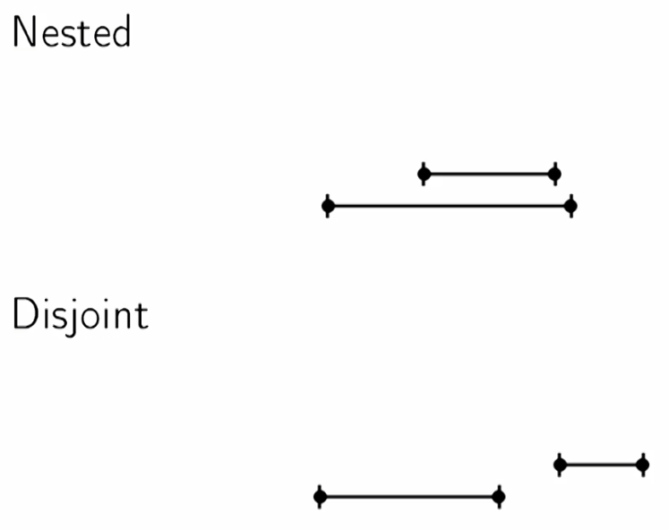
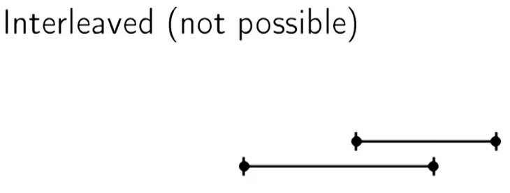

# Decomposition of Graphs

## Graph Basics

- **undirected graph**: A collection `V` of *vertices*, and a collection `E` of *edges* each of whch connects a pair of vertices



Vertices: A, B, C, D

Edges: (A, B), (A, C), (A, D), (C, D)

- **loops**: Connect a vertex to itself



Vertices: A

Edges: (A, A)

- Can have multiple edges between same vertices



Vertices: A, B

Edges: (A, B), (A, B)

- Sometimes loops and multiple edges matter, but a lot of the time they are considered degeneracies we don't need to worry about

- **simple graph**: A graph with no loops and no multiple edges

## Representing Graphs

Given the below graph, there are multiple ways to represent it:


1. Edge List
    - Simply a list of all edges:
`(A, B), (A, C), (A, D), (C, D)`

2. Adjacency Matrix
    - a matrix where a 1 represents an edge and a 0 represents no edge:
```
  A B C D
A 0 1 1 1
B 1 0 0 0
C 1 0 0 1
D 1 0 1 0
```

3. Adjacency List
    - For each vertex, a list of adjacent vertices:

```
A: [B, C, D]
B: [A]
C: [A, D]
D: [A, C]
```

### Different operations are faster in different representations

|                  | Is Edge? | List Edges | List Neighbors |
|------------------|----------|------------|----------------|
| Adjacency Matrix | O(1)     | O(\|V\|<sup>2</sup>)  | O(\|V\|)       |
| Edge List        | O(\|E\|) | O(\|E\|)   | O(\|E\|)       |
| Adjacency List   | O(deg)   | O(\|E\|)   | O(deg)         |

- `deg`: "degree" of a vertex (how many neightbors it has)
- For many problems, we want *adjacency list*

## Algorithm Runtimes

- depend on `|V|` and `|E|` (number of vertices and number of edges)
- so 2 quantities (i.e. opposed to "usual" simply depending on size of input N)
- examples:
    - O(|V| + |E|)
    - O(|V||E|)
    - O(|V|<sup>3/2</sup>)
    - O(|V|log(|V|) + |E|)

### Density

Which is faster: O(|V|<sup>3/2</sup>), or O(|E|) ?

It depends on the graph -- namely the **density**; how many edges you have in terms of the number of vertices

2 extremes: **dense graphs** and **sparse graphs**

### Dense Graphs
- |E| ~= |V|<sup>2</sup>
- a large fraction of pairs of vertices are connected by edges



### Sparse Graphs
- |E| ~= |V|
- each vertex has only a few edges



## Exploring Graphs

How do we tell if a given vertex is reachable from another?

### Paths

A **path** in a graph G is a sequence of vertices (v<sub>0</sub>, v<sub>1</sub>, ..., v<sub>n</sub>) such that for all *i*, (v<sub>i</sub>, v<sub>i + 1</sub>) is an edge of G.

### Formal Description

Input: Graph *G* and vertext *s*

Output: Collection of vertices *v* of *G* such that there is a **path** from *s* to *v*

### Pseudocode
```
DiscoveredNodes <- s
while there is an edge e leaving DiscoveredNodes that has not been explored:
    add vertex at other end of e to DiscoveredNodes
return DiscoveredNodes
```

- we need some bookkeeping for this algorithm
    - how to keep track of edges/vertices we have dealt with?
    - what order to explore new edges in?

- visit markers: give each vertex a boolean value `visited(v)`
- keep a list of vertices with edges left to check
    - this will end up getting "hidden" in the stack
- order: let's just use Depth First order to start
    - follow long path forward, until either reach a dead end or encounter vertex we've already seen
    - at that point, backtrack 1 vertex up the path, and restart algorithm from here

### more pseudocode

```
Explore(v)
    visited(v) = true
    for (v, w) in Neighbors(v):
        if not visited(w):
            Explore(w)
```

- this algorithm works best with **adjacency list* representation, due to the fact that we have easy access to list of neighbors of each vertex

## Reach All Vertices

Sometimes we want to find *all* vertices of *G*, not just those reachable from *v*.

- **Depth First Search**
- slightly more complex algorithm, but not by much:

```
DFS(G)
    for v in V:
        visited(v) = false
    for v in V:
        if not visited(v):
            Explore(v)
```

### Runtime of Depth First Search

Number of calls to `explore`:
- each explored vertex is marked visited
- no vertex is explored after visited once
- thus, each vertex is explored exactly once 

Checking for neighbors:
- each vertex checks each neighbor
- so we have to do work *for each neighbor, of each vertex*
- total number of neighbors over all vertices is O(|E|)

Total Runtime:
- O(1) per vertex
- O(1) per edge
- Total O(|V| + |E|) -- linear time

## Connected Components

**Theorem**: The vertices of a graph *G* can be partitioned into *connected components* such that *v* is reachable from *w* if and only if *v* and *w* are in the same connected component.

### Algorithm to find connected components

- we know `Explore(v)` basically finds the connected component of *v*
- so we can make small modification to DFS to do this
- modify our goal: insted of returning sets of vertices of each connected component, let's *label* each connected component

### Pseudocode

```
Explore(v):
    visited(v) = true
    CCnum(v) = cc
    for (v, w) in Neighbors(v):
        if not visited(w):
            Explore(w)

DFS(G):
    for v in V:
        visited(v) = false
    cc = 1
    for v in V:
        if not visited(v):
            Explore(v)
            cc += 1
```

### Runtime

Same as DFS: O(|V| + |E|)

## Previsit and Postvisit Orderings

- so far, our DFS just marks all vertices as visited
    - not really useful
- to make DFS useful for different purposes, we need to keep track of some other data/do a little bit of additional work
    - for example, when we computed connected components, we kept the additional label
- we can delegate this task of performing additional work/recording other data to certain functions within the DFS algorithm

```
Explore(v):
    visited(v) = true
    previsit(v)
    for (v, w) in Neighbors(v):
        if not visited(w):
            Explore(w)
    postvisit(v)
```

### Clock

- keep track of order of visits
- clock ticks at each pre-/post-visit
- record the previsit and postvisit time for each *v*

```
initialize clock = 1

previsit(v):
    pre(v) = clock
    clock += 1

postvisit(v):
    post(v) = clock
    clock += 1
```

- previsit and postvisit numbers tell us about the execution of DFS
- **lemma**: For any vertices *u, v* the intervals `[pre(u), post(u)]` and `[pre(v), post(v)]` are either *nested* or *disjoint*



